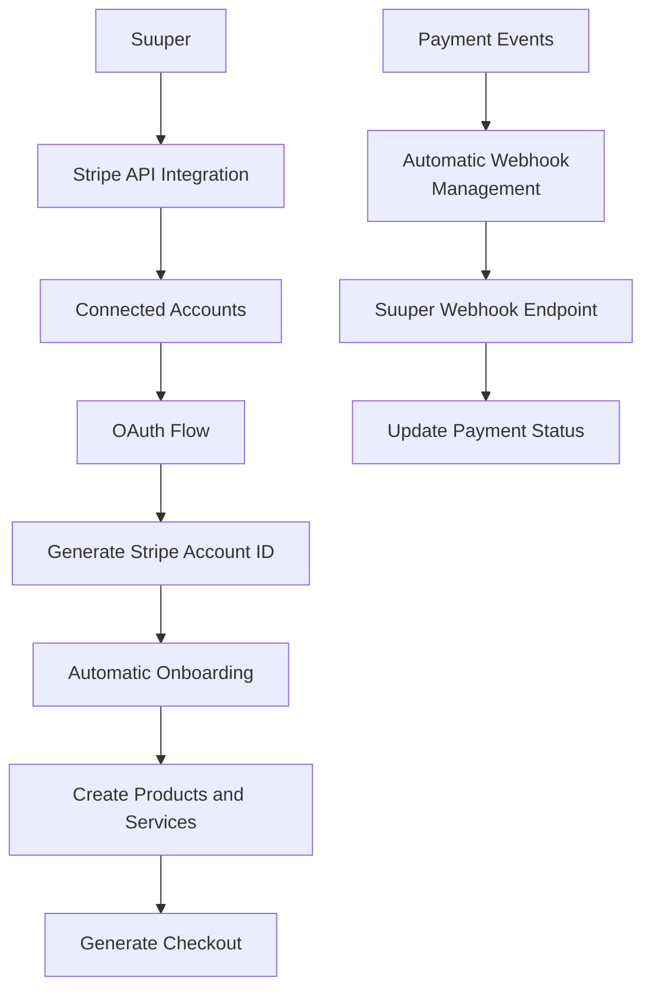
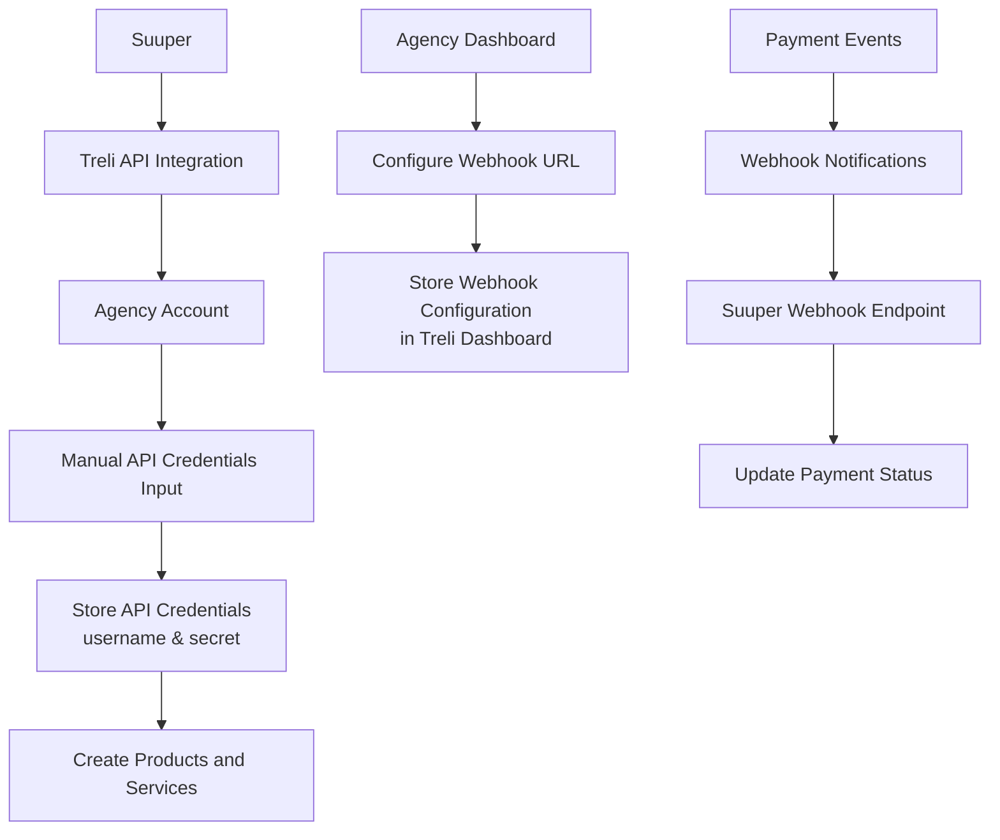
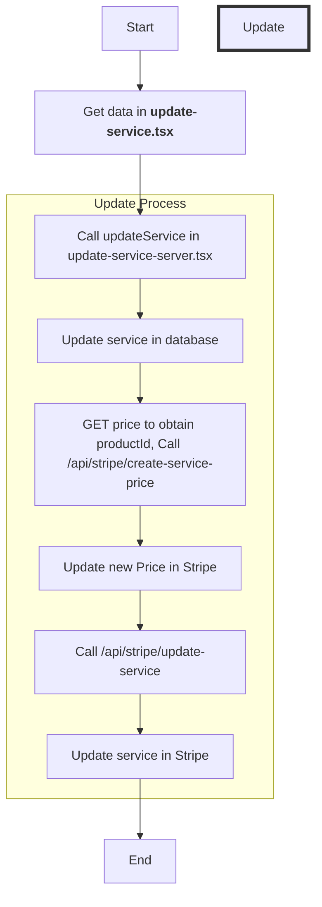
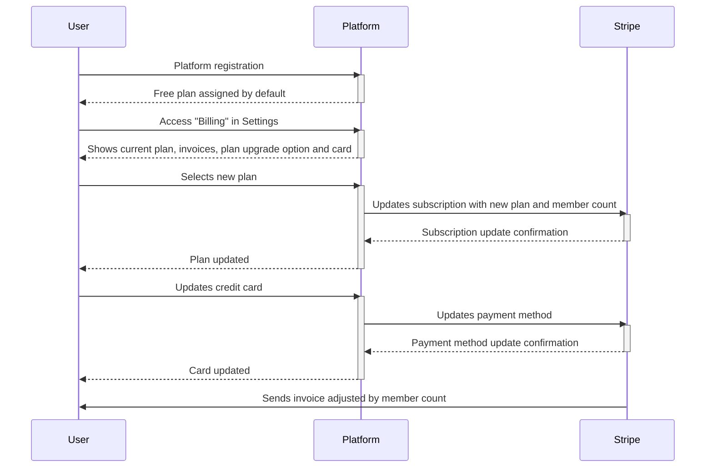
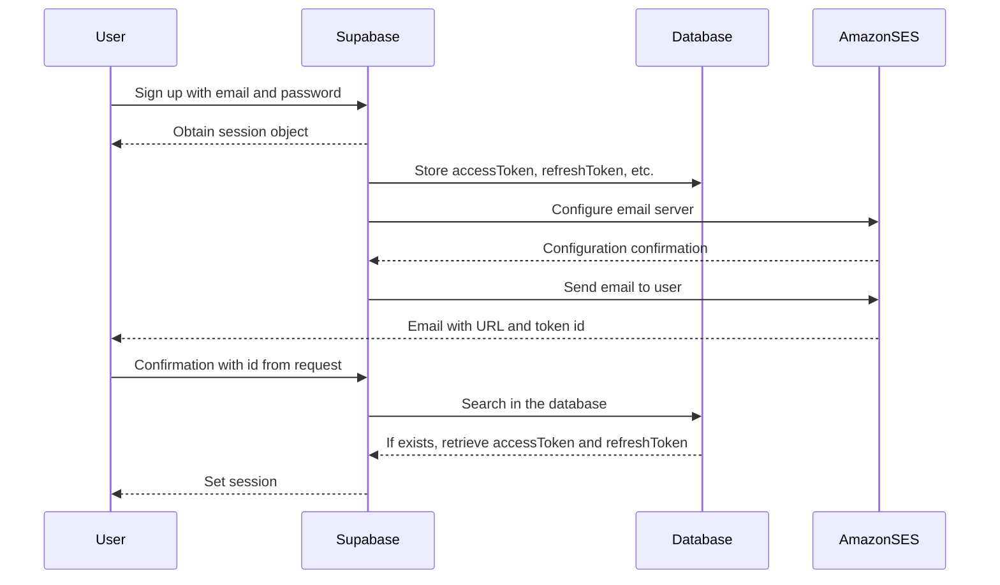
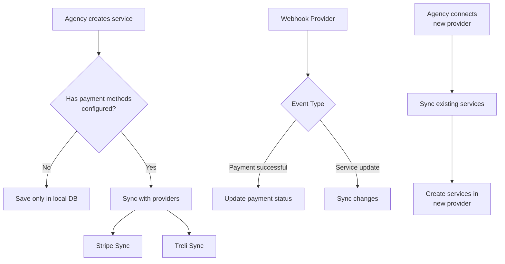

# Makerkit - Supabase SaaS Starter Kit - Turbo Editions

This is a Starter Kit for building SaaS applications using Supabase, Next.js, and Tailwind CSS.

This version uses Turborepo to manage multiple packages in a single repository.

**This project is stable but still under development. Please update the repository daily**.

This repository is the demo version hosted on Cloudflare Pages. Please use the vanilla kit as starter - as this is used for testing all the features.

[Please follow the documentation to get started](https://makerkit.dev/docs/next-supabase-turbo/introduction).

# Stripe Integration

# Treli Integration

## Update service stripe

Files: [update-service.tsx](./packages/features/team-accounts/src/server/actions/services/update/update-service.tsx)

## Stripe Billing Suuper

## Email Confirmation Flow Implementation for Supabase with Amazon SES Integration

## Billing integration for agencies [Treli, Stripe]

# Payment Provider Integration: Treli vs Stripe

## Treli Integration

### Connection Model
- **Type**: Direct connection via API credentials
- **Process**: Manual
- **Required Credentials**:
  - Username
  - Production Secret Password
  - Location: https://treli.co/account/settings/api/

### Webhook Configuration
- **Type**: Manual configuration per agency
- **Process**:
  1. Each agency must access their Treli dashboard
  2. Navigate to: https://treli.co/account/settings/webhooks/
  3. Configure the URL provided by Suuper
  4. Activate all necessary events

### Limitations
- No parent/child account concept
- Manual configuration required per agency
- Individual webhook management

## Stripe Integration

### Connection Model
- **Type**: OAuth + Connected Accounts
- **Process**: Automated
- **Credentials**:
  - Automatic Stripe Account ID generation
  - Automatic access token management

### Webhook Configuration
- **Type**: Automatic through API
- **Process**:
  1. One-time platform-level configuration
  2. Webhooks automatically configured for all connected accounts
  3. Centralized event management

### Advantages
- Automated onboarding system
- Centralized connected account management
- Automatic webhook configuration

## Implementation Considerations

### For Treli
1. **Secure Credential Storage**
   - Encrypt API credentials
   - Implement secret rotation system

2. **Onboarding Process**
   - Create step-by-step guide for agencies
   - Implement credential validation
   - Verify webhook configuration

3. **Monitoring**
   - Implement webhook health checks
   - Connection failure alert system

### For Stripe
1. **OAuth Management**
   - Implement authorization flow
   - Handle token renewal

2. **Automation**
   - Leverage APIs for automatic configuration
   - Implement bidirectional synchronization

3. **Monitoring**
   - Use Stripe Dashboard for supervision
   - Implement detailed event logging