# Makerkit - Supabase SaaS Starter Kit - Turbo Editions

This is a Starter Kit for building SaaS applications using Supabase, Next.js, and Tailwind CSS.

This version uses Turborepo to manage multiple packages in a single repository.

**This project is stable but still under development. Please update the repository daily**.

This repository is the demo version hosted on Cloudflare Pages. Please use the vanilla kit as starter - as this is used for testing all the features.

[Please follow the documentation to get started](https://makerkit.dev/docs/next-supabase-turbo/introduction).

# Stripe Integration 🚀 

## Update service stripe

Files: [update-service.tsx](./packages/features/team-accounts/src/server/actions/services/update/update-service.tsx)

## Stripe Billing

```mermaid
sequenceDiagram
    participant Usuario
    participant Plataforma
    participant Stripe

    Usuario->>Plataforma: Registro en la plataforma
    activate Plataforma
    Plataforma-->>Usuario: Plan Free asignado por defecto
    deactivate Plataforma

    Usuario->>Plataforma: Accede a "Billing" en Settings
    activate Plataforma
    Plataforma-->>Usuario: Muestra plan actual, facturas, opción de actualización de plan y tarjeta
    deactivate Plataforma

    Usuario->>Plataforma: Selecciona nuevo plan
    activate Plataforma
    Plataforma->>Stripe: Actualiza suscripción con nuevo plan y número de miembros
    activate Stripe
    Stripe-->>Plataforma: Confirmación de actualización de suscripción
    deactivate Stripe
    Plataforma-->>Usuario: Plan actualizado
    deactivate Plataforma

    Usuario->>Plataforma: Actualiza tarjeta de crédito
    activate Plataforma
    Plataforma->>Stripe: Actualiza método de pago
    activate Stripe
    Stripe-->>Plataforma: Confirmación de método de pago actualizado
    deactivate Stripe
    Plataforma-->>Usuario: Tarjeta actualizada
    deactivate Plataforma

    Stripe->>Usuario: Envía factura ajustada por número de miembros
```

