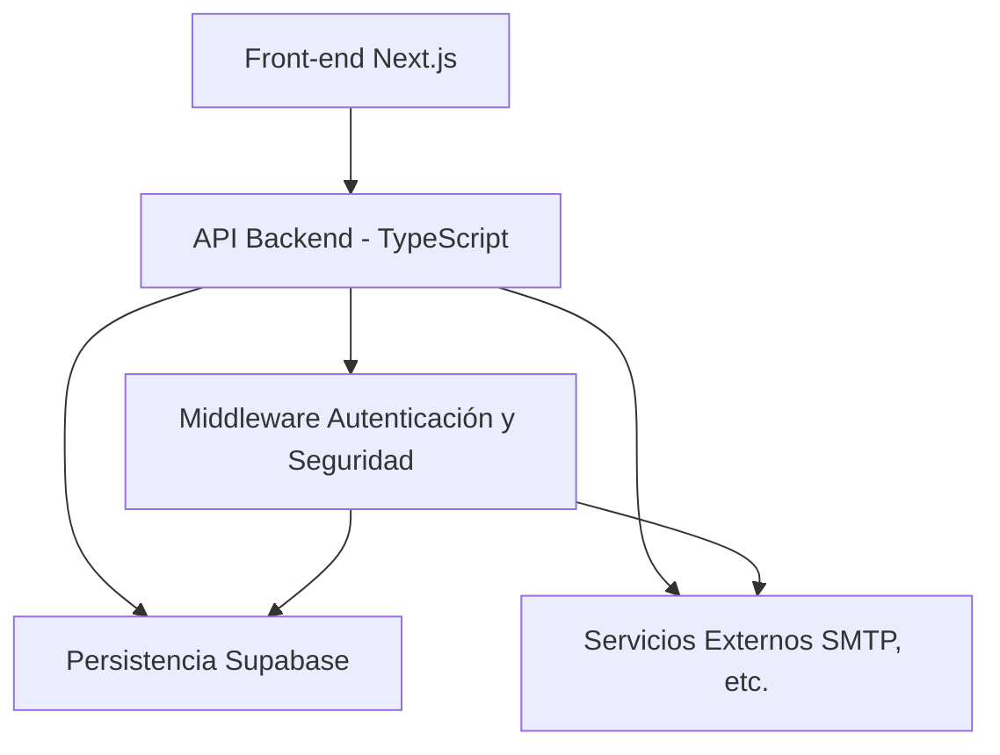
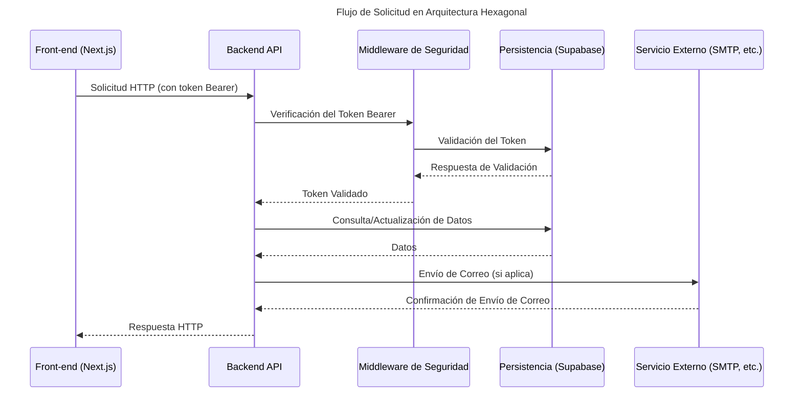
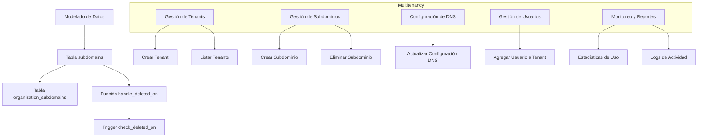

# API Documentation - Suuper - Current Version v1

```mermaid
graph TD;
    A[Front-end Next.js] --> B[API Backend - TypeScript];
    B --> E[Middleware Autenticación y Seguridad];
    B --> C[Persistencia Supabase];
    B --> D[Servicios Externos SMTP, etc.];
    E --> C;
    E --> D;
```

```mermaid
sequenceDiagram
    title Flujo de Solicitud en Arquitectura Hexagonal

    participant Client as Front-end (Next.js)
    participant API as Backend API
    participant Middleware as Middleware de Seguridad
    participant DB as Persistencia (Supabase)
    participant Service as Servicio Externo (SMTP, etc.)

    Client->>API: Solicitud HTTP (con token Bearer)
    API->>Middleware: Verificación del Token Bearer
    Middleware->>DB: Validación del Token
    DB-->>Middleware: Respuesta de Validación
    Middleware-->>API: Token Validado
    API->>DB: Consulta/Actualización de Datos
    DB-->>API: Datos
    API->>Service: Envío de Correo (si aplica)
    Service-->>API: Confirmación de Envío de Correo
    API-->>Client: Respuesta HTTP
```

## Routes

## Secularization

## Multitenancy- Subdomains

```mermaid 
graph TD;
    A[Modelado de Datos] --> B[Tabla subdomains]
    B --> C[Tabla organization_subdomains]
    B --> D[Función handle_deleted_on]
    D --> E[Trigger check_deleted_on]
    
    subgraph Multitenancy
        F[Gestión de Tenants]
        G[Gestión de Subdominios]
        H[Configuración de DNS]
        I[Gestión de Usuarios]
        J[Monitoreo y Reportes]
    end
    
    F --> K[Crear Tenant]
    F --> L[Listar Tenants]
    G --> M[Crear Subdominio]
    G --> N[Eliminar Subdominio]
    H --> O[Actualizar Configuración DNS]
    I --> P[Agregar Usuario a Tenant]
    J --> Q[Estadísticas de Uso]
    J --> R[Logs de Actividad]
```