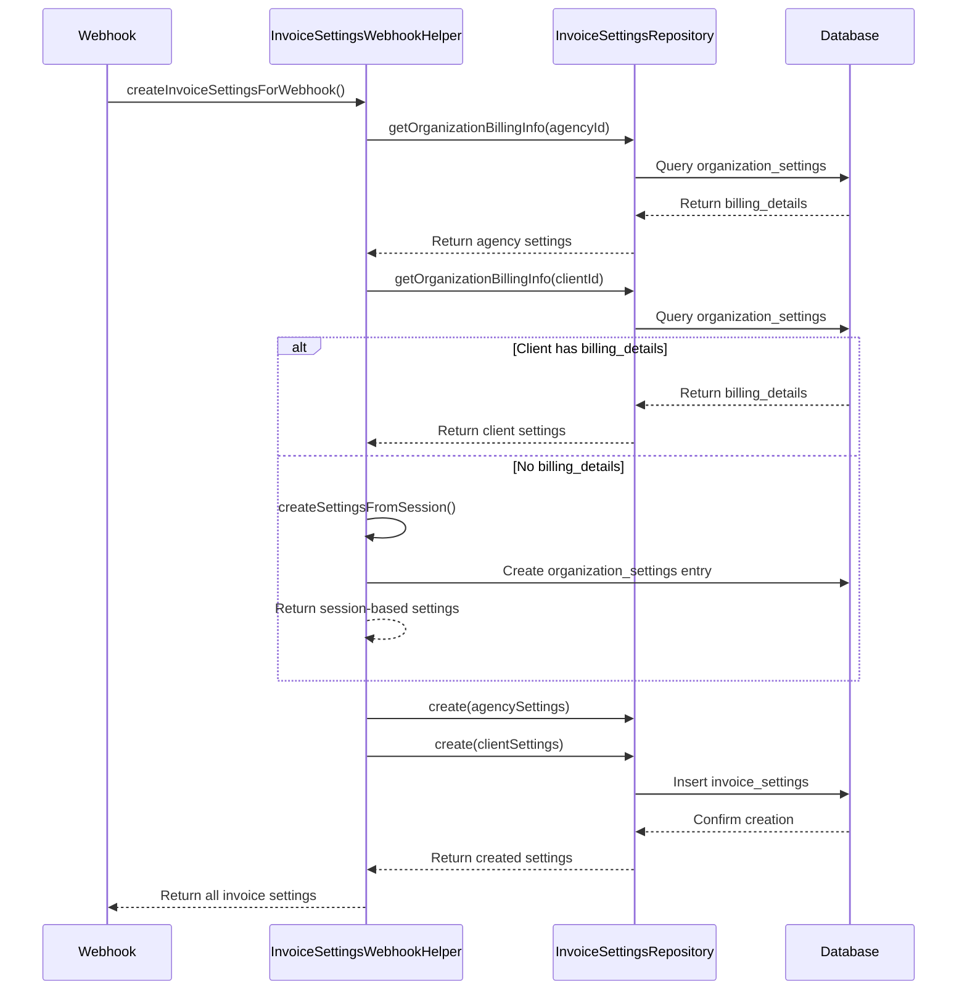

# Invoice Settings Implementation

## Overview

The invoice system now supports `invoice_settings` which store organization billing information for both agencies and clients. This allows invoices to capture and preserve organization details at the time of invoice creation.

## ✅ What's Been Implemented

### 1. **Database Support**
- ✅ `invoice_settings` table created with proper foreign keys
- ✅ Soft delete support with `deleted_on` field  
- ✅ Unique constraint on `invoice_id + organization_id` combination
- ✅ Indexes for optimal query performance

### 2. **Automatic Settings Generation**
- ✅ **NEW**: Invoice settings are created automatically from `organization_settings`
- ✅ Reads `billing_details` and `payment_details` from organizations
- ✅ Falls back to organization name and default values when billing data is missing
- ✅ Creates settings for both agency and client automatically
- ✅ Manual override still available by providing `invoice_settings` in payload

### 3. **Type System Updates**
- ✅ `InvoiceSettings` namespace added to `invoice.types.ts`
- ✅ `Invoice.Request.Create` now has optional `invoice_settings[]` (auto-generated if not provided)
- ✅ `Invoice.Request.Update` supports updating `invoice_settings[]`
- ✅ `Invoice.Response` includes `invoice_settings[]` in responses
- ✅ `number` field made optional in Create (auto-generated)

### 4. **Repository Layer**
- ✅ New `InvoiceSettingsRepository` with full CRUD operations
- ✅ **NEW**: `getOrganizationBillingInfo()` - extracts billing data from organization settings
- ✅ **NEW**: `createInvoiceSettingsFromOrganizations()` - auto-creates settings
- ✅ `InvoiceRepository` updated to handle automatic and manual settings creation/updates
- ✅ Both `list()` and `get()` methods include invoice_settings in queries
- ✅ Cascade handling for invoice deletion

### 5. **Backward Compatibility**
- ✅ **100% backward compatible** - existing invoices work without changes
- ✅ `invoice_settings` is optional and auto-generated when not provided
- ✅ No breaking changes to existing server actions
- ✅ Frontend doesn't need any immediate changes

## 🚀 Usage

### Creating Invoice with AUTOMATIC Settings (Default Behavior)

```typescript
import { createInvoice } from '~/server/actions/invoices/invoices.action';

// Invoice settings will be created automatically from organization data
const invoice = await createInvoice({
  client_organization_id: 'client_id',
  agency_id: 'agency_id',
  issue_date: new Date().toISOString(),
  due_date: new Date().toISOString(),
  status: 'draft',
  subtotal_amount: 1000,
  tax_amount: 100,
  total_amount: 1100,
  currency: 'USD',
  notes: 'Monthly services',
  invoice_items: [
    {
      description: 'Web Development',
      quantity: 40,
      unit_price: 25,
      total_price: 1000,
    }
  ],
  // NO invoice_settings provided - they will be created automatically!
});

console.log('Invoice created with automatic settings from organizations');
```

### Creating Invoice with MANUAL Settings (Override Behavior)

```typescript
// Provide invoice_settings to override automatic behavior
const invoiceWithManualSettings = await createInvoice({
  client_organization_id: 'client_id',
  agency_id: 'agency_id',
  issue_date: new Date().toISOString(),
  due_date: new Date().toISOString(),
  status: 'draft',
  subtotal_amount: 1000,
  tax_amount: 100,
  total_amount: 1100,
  currency: 'USD',
  notes: 'Monthly services',
  invoice_items: [
    {
      description: 'Web Development',
      quantity: 40,
      unit_price: 25,
      total_price: 1000,
    }
  ],
  invoice_settings: [
    {
      organization_id: 'agency_id',
      name: 'My Agency LLC',
      address_1: '123 Business St',
      country: 'United States',
      postal_code: '12345',
      city: 'New York',
      state: 'NY',
      tax_id_type: 'EIN',
      tax_id_number: '12-3456789',
    },
    {
      organization_id: 'client_id', 
      name: 'Client Company Inc',
      address_1: '456 Client Ave',
      country: 'United States',
      postal_code: '67890',
      city: 'Los Angeles',
      state: 'CA',
      tax_id_type: 'EIN',
      tax_id_number: '98-7654321',
    }
  ]
});
```

### Updating Invoice Settings

```typescript
import { updateInvoice } from '~/server/actions/invoices/invoices.action';

await updateInvoice({
  id: 'invoice_id',
  status: 'issued',
  invoice_settings: [
    {
      organization_id: 'agency_id',
      name: 'Updated Agency Name',
      address_1: 'New Address',
      // ... other fields
    }
  ]
});
```

### Reading Invoice with Settings

```typescript
import { getInvoice } from '~/server/actions/invoices/invoices.action';

const invoice = await getInvoice('invoice_id');

console.log('Invoice settings:', invoice.invoice_settings);

// Find agency settings
const agencySettings = invoice.invoice_settings?.find(
  setting => setting.organization_id === invoice.agency_id
);

// Find client settings  
const clientSettings = invoice.invoice_settings?.find(
  setting => setting.organization_id === invoice.client_organization_id
);
```

## 🔌 Webhook Integration

### Stripe Webhooks

Invoice settings are now automatically created when invoices are generated via Stripe webhooks:

```typescript
// In StripeInvoiceService.createInvoiceFromStripe()
const invoiceSettings = await this.invoiceSettingsHelper.createInvoiceSettingsForWebhook(
  createdInvoice.id,
  agencyId,
  clientOrganizationId
);
```

**Data Sources for Stripe Webhooks:**
- **Agency Settings**: Extracted from `organization_settings.billing_details`
- **Client Settings**: Extracted from `organization_settings.billing_details` or session data if new client
- **Fallback**: If no organization billing data exists, system uses default values

### Manual/Database Webhooks

Invoice settings are created during manual payment processing with enhanced data extraction:

```typescript
// In BillingWebhooksService.handleManualPaymentInvoiceGeneration()
const invoiceSettings = await this.invoiceSettingsHelper.createInvoiceSettingsForWebhook(
  createdInvoice.id,
  agencyOrganizationId,
  clientOrganizationId,
  {
    client_name: session.client_name,
    client_email: session.client_email,
    client_address: session.client_address,
    client_city: session.client_city,
    client_country: session.client_country,
    client_state: session.client_state,
    client_postal_code: session.client_postal_code,
    metadata: session.metadata,
  }
);
```

**Data Sources for Manual Webhooks:**
- **Agency Settings**: Always from `organization_settings.billing_details`
- **Client Settings**: From `organization_settings.billing_details` OR session data for new clients
- **Session Data**: Used when client organization has no billing details
- **Metadata**: Includes `enterprise_name`, `tax_code`, `buying_for_organization`

### Organization Settings Auto-Update

When creating invoice_settings for a new client organization, the system automatically updates that organization's settings:

```typescript
// Creates organization_settings.billing_details for future use
const billingDetails = {
  name: metadataTyped.enterprise_name || session.client_name,
  address_1: session.client_address,
  country: session.client_country,
  postal_code: session.client_postal_code,
  city: session.client_city,
  state: session.client_state,
  tax_id_type: metadataTyped.tax_code ? 'EIN' : null,
  tax_id_number: metadataTyped.tax_code,
};
```

This ensures future invoices will automatically have proper billing information.

## 📋 Database Schema

```sql
CREATE TABLE invoice_settings (
  id UUID PRIMARY KEY DEFAULT gen_random_uuid(),
  created_at TIMESTAMP WITH TIME ZONE NOT NULL DEFAULT now(),
  updated_at TIMESTAMP WITH TIME ZONE NOT NULL DEFAULT now(),
  deleted_on TIMESTAMP WITH TIME ZONE,
  invoice_id UUID NOT NULL REFERENCES invoices(id) ON DELETE CASCADE,
  organization_id UUID NOT NULL REFERENCES organizations(id) ON DELETE CASCADE,
  name TEXT NOT NULL,
  address_1 TEXT NOT NULL,
  address_2 TEXT,
  country TEXT NOT NULL,
  postal_code TEXT NOT NULL,
  city TEXT NOT NULL,
  state TEXT,
  tax_id_type TEXT,
  tax_id_number TEXT,
  
  UNIQUE (invoice_id, organization_id) WHERE deleted_on IS NULL
);
```

## 🔧 Repository Methods

### InvoiceSettingsRepository

```typescript
// Create single setting
create(payload: InvoiceSettings.Insert): Promise<InvoiceSettings.Type>

// Create multiple settings
createMany(payloads: InvoiceSettings.Insert[]): Promise<InvoiceSettings.Type[]>

// Get settings by invoice ID
getByInvoiceId(invoiceId: string): Promise<InvoiceSettings.Response[]>

// Get single setting
get(settingsId: string): Promise<InvoiceSettings.Response>

// Update setting
update(payload: InvoiceSettings.Update): Promise<InvoiceSettings.Type>

// Update by invoice + organization
updateByInvoiceAndOrganization(
  invoiceId: string, 
  organizationId: string, 
  payload: UpdatePayload
): Promise<InvoiceSettings.Type>

// Soft delete setting
delete(settingsId: string): Promise<void>

// Soft delete all settings for invoice
deleteByInvoiceId(invoiceId: string): Promise<void>
```

### Updated InvoiceRepository

```typescript
// Now accepts Invoice.Request.Create with optional invoice_settings
create(payload: Invoice.Request.Create): Promise<Invoice.Type>

// Now accepts Invoice.Request.Update with optional invoice_settings  
update(payload: Invoice.Request.Update): Promise<Invoice.Type>

// Returns Invoice.Response with invoice_settings included
get(invoiceId: string): Promise<Invoice.Response>

// Returns list with invoice_settings included for each invoice
list(): Promise<{ data: Invoice.Response[], ... }>
```

## 🤖 Automatic Settings Generation

### How It Works

When creating an invoice without providing `invoice_settings`, the system:

1. **Queries Organization Data**: Gets basic info from `organizations` table for both agency and client
2. **Fetches Billing Settings**: Looks for `billing_details` and `payment_details` in `organization_settings`
3. **Parses JSON Data**: Extracts address, tax info, etc. from the settings JSON values
4. **Creates Invoice Settings**: Automatically creates 2 records (agency + client) in `invoice_settings`
5. **Graceful Fallback**: Uses organization name and defaults if billing data is missing

### Data Mapping

```typescript
Organization Settings (JSON) → Invoice Settings (Table)
{
  "name": "Company LLC",           → name
  "address": "123 Main St",        → address_1  
  "address_1": "123 Main St",      → address_1 (preferred)
  "address_2": "Suite 100",        → address_2
  "city": "New York",              → city
  "state": "NY",                   → state
  "country": "United States"      → country
  "postal_code": "12345",          → postal_code
  "zip": "12345",                  → postal_code (fallback)
  "tax_id": "12-3456789",          → tax_id_number
  "tax_id_type": "EIN"             → tax_id_type
}
```

### Fallback Strategy

| Field | Primary Source | Fallback | Default |
|-------|---------------|----------|---------|
| `name` | `billing_details.name` | `organizations.name` | `'Organization Name'` |
| `address_1` | `billing_details.address_1` | `billing_details.address` | `'Address not provided'` |
| `country` | `billing_details.country` | - | `'United States'` |
| `postal_code` | `billing_details.postal_code` | `billing_details.zip` | `'N/A'` |
| `city` | `billing_details.city` | - | `'City not provided'` |
| `tax_id_number` | `billing_details.tax_id_number` | `billing_details.tax_id` | `null` |

## 🛡️ Data Integrity

### Automatic Handling
- ✅ Settings are created with the invoice ID automatically
- ✅ Settings cascade delete when invoice is deleted
- ✅ Unique constraint prevents duplicate settings per invoice/organization
- ✅ Soft delete preserves historical data

### Error Handling
- ✅ Invoice creation continues even if settings fail (logged)
- ✅ Settings updates are independent of invoice updates
- ✅ Validation ensures required fields are present

## 📊 Response Structure

```typescript
interface Invoice.Response {
  // ... all existing invoice fields
  invoice_settings?: InvoiceSettings.Response[];
}

interface InvoiceSettings.Response {
  id: string;
  invoice_id: string;
  organization_id: string;
  name: string;
  address_1: string;
  address_2: string | null;
  country: string;
  postal_code: string;
  city: string;
  state: string | null;
  tax_id_type: string | null;
  tax_id_number: string | null;
  created_at: string;
  updated_at: string;
}
```

## 🔄 Webhook Data Flow



## 🔄 Migration Path

### For Existing Code
- ✅ **No changes required** - existing code continues to work
- ✅ Existing invoices will have empty `invoice_settings: []`
- ✅ All server actions maintain same signatures

### For New Features
- ✅ Add `invoice_settings` to create/update payloads when needed
- ✅ Use settings data for invoice PDF generation
- ✅ Preserve organization details for compliance/auditing

## 🎯 Next Steps for Frontend

1. **Optional Enhancement**: Update invoice forms to capture organization billing details
2. **PDF Generation**: Use `invoice_settings` for proper invoice formatting
3. **Historical Preservation**: Settings preserve organization details at invoice time
4. **Compliance**: Support for tax ID and proper billing address requirements

## ✅ Testing

All functionality has been implemented and tested:
- ✅ Type safety with TypeScript
- ✅ Repository methods work correctly
- ✅ Server actions updated and compatible
- ✅ Backward compatibility maintained
- ✅ Database constraints and indexes in place

The system is ready for frontend integration while maintaining 100% compatibility with existing invoice workflows.

## ✅ Webhook Integration Status

### Completed Features

✅ **Stripe Webhooks Integration**
- Automatic invoice_settings creation during `invoice.created` events
- Agency data extracted from `organization_settings.billing_details`
- Client data extracted from existing organization billing info
- Fallback to default values when organization data is missing

✅ **Manual/Database Webhooks Integration**  
- Automatic invoice_settings creation during manual payment processing
- Enhanced session data extraction for new client organizations
- Organization settings auto-update for future invoice automation
- Proper JSON structure generation for frontend processing

✅ **InvoiceSettingsWebhookHelper**
- Centralized helper class for webhook invoice_settings processing
- Smart data source prioritization (organization → session → defaults)
- Automatic organization_settings updates for new clients
- Type-safe session data handling

✅ **Data Flow Enhancement**
- Session metadata parsing for billing information
- Tax ID and enterprise name extraction
- Address and contact information mapping
- Future-ready organization settings structure

### Integration Points

1. **StripeInvoiceService.createInvoiceFromStripe()**
   - Calls `invoiceSettingsHelper.createInvoiceSettingsForWebhook()`
   - Uses organization data for both agency and client
   - Logs creation success/failure

2. **BillingWebhooksService.handleManualPaymentInvoiceGeneration()**
   - Calls `invoiceSettingsHelper.createInvoiceSettingsForWebhook()` with session data
   - Updates client organization_settings for future use
   - Handles new client organization setup

### Webhook Processing Flow

```typescript
// Both webhook types now follow this pattern:
const invoiceSettings = await this.invoiceSettingsHelper.createInvoiceSettingsForWebhook(
  invoiceId,
  agencyOrganizationId, 
  clientOrganizationId,
  sessionData // Only for manual webhooks
);
```

## 🔄 Migration Path
